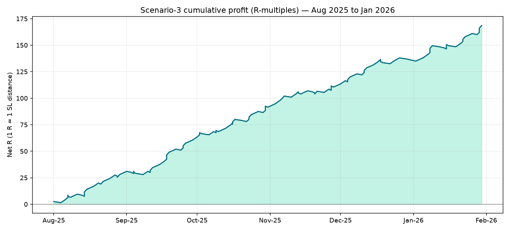
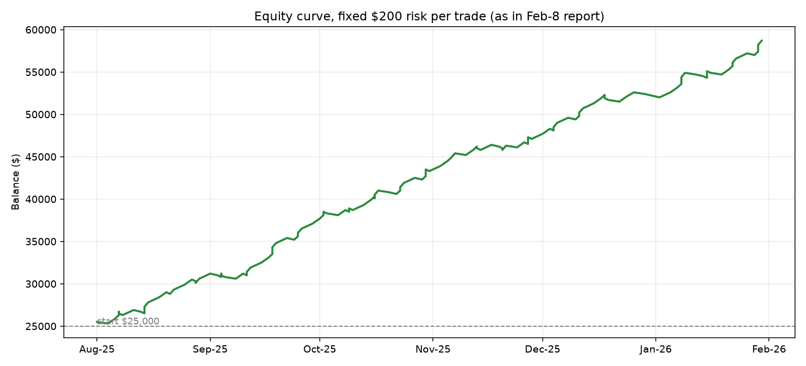
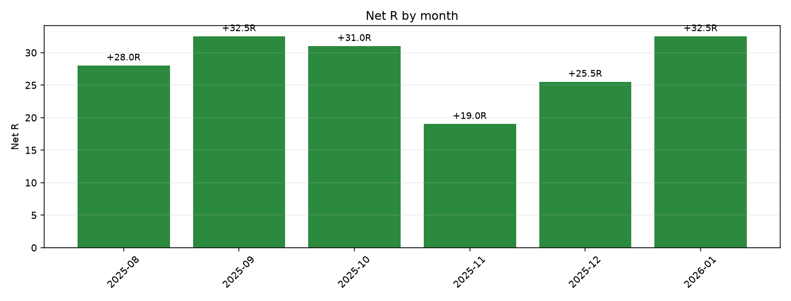

# ORB Strategy — Analysis of Your Backtest & Forward-Test Plan

*Prepared 2026‑09‑08 from the files in this repository: `app.py`, `ORB_Report_20260208_151229.pdf`, the three screenshots from 2026‑02‑08, and the six MT5 CSV exports (Aug 2025 – Jan 2026).*

---

## 1. TL;DR

Your strategy is a **daily Opening‑Range‑Breakout (ORB) system** traded on **3 currency pairs (USDCAD, GBPUSD, EURUSD)**, at **fixed weekday × pair × time windows**, using the 15‑minute candle that opens at that window as the "range", buying/selling only on a confirmed close **outside** that range, with a stop on the opposite side of the range (+2‑pip buffer) and a fixed reward:risk (2:1 to 3:1).

- **Which days / assets you trade (from `app.py`, "Scenario 3 — 60%+ win‑rate only"):**

| Day | Pair | Window (GMT) | Window (IST) | RR | Expected WR |
|---|---|---|---|---|---|
| Monday | USDCAD | 15:45 | 9:15 PM | 1:3 | 61.5% |
| Wednesday | GBPUSD | 15:00 | 8:30 PM | 1:3 | 61.5% |
| Thursday | USDCAD | 11:15 | 4:45 PM | 1:2 | 72.7% |
| Thursday | EURUSD | 11:30 | 5:00 PM | 1:2 | 66.7% |
| Thursday | GBPUSD | 03:45 | 9:15 AM | 1:2 | 63.6% |
| Friday | USDCAD | 16:00 | 9:30 PM | 1:2.5 | 63.0% |
| Tuesday | — | no trade (nothing ≥60% WR) | | | |

- **Performance over the backtest (1 Aug 2025 – 30 Jan 2026, 6 months / 131 trading days), reproduced exactly from your CSVs:** **136 trades, 88 wins / 48 losses = 64.7% win rate, +168.5R net. At the $25,000 / $200‑per‑trade sizing used in your Feb‑8 report: +$33,700 (+134.8% in 6 months), worst drawdown $800 (1.9%). Every calendar month was profitable.**
- **Forward test (Feb–Sep 2026):** the harness is ready in this repo, **but the 7 months of new data (Feb 2026 → now) are not in the repository and this sandbox has no internet to download broker data.** Drop the six new MT5 CSV exports into the repo and the whole out‑of‑sample test runs with one command (Section 6).

---

## 2. The strategy, as implemented in `app.py`

The app contains a filtered "Scenario 3" subset of a bigger study (the PDF report also shows Scenarios 1, 2 and 4 — see §5). Every trade is generated by exactly this rule-set:

1. **ORB candle** — take the **15‑minute candle at the setup's GMT time** and mark its HIGH and LOW (the "opening range" for that session window).
2. **Range filter** — the ORB range must be between 2 and 100 pips, otherwise skip the day.
3. **Breakout confirmation** — wait for a candle to **CLOSE above the ORB high** (Long) or **below the ORB low** (Short). Only the first breakout of the day counts (no re‑entries).
4. **Entry** — at the **close** of the breakout candle.
5. **Stop loss** — opposite side of the ORB range **+ 2 pip buffer**.
6. **Take profit** — `risk × RR` where RR is fixed per setup (2.0 / 2.5 / 3.0).
7. **One trade per pair per day; trades are closed at TP or SL.** If neither is hit, the position is closed at the last candle of the day ("EOD close", rare).
8. Days/setups with historical win rate below 60% were **removed** — that is why Tuesday has no trades (all Tuesday candidates were 50–58% in the study).

Note on the time stamps: the app stores the window in `time_gmt` and shows it in `time_ist` (IST = GMT+5:30). MT5 exports are in the broker's server time, so if your broker server is not GMT, the "GMT" column in the schedule is really "server time" as exported.

---

## 3. Backtest performance (Aug 1, 2025 → Jan 30, 2026)

These figures are a **byte‑for‑byte reproduction**: I extracted the exact engine code from `app.py`, ran it on the repo's six CSVs, and got the identical trade log and numbers as the `ORB_Report_20260208_151229.pdf` (136 trades, 88/48, 64.71%, $33,700 profit, PF 4.51, MaxDD 1.92%, final equity $58,700).

### 3.1 Overall

| Metric | Value |
|---|---|
| Period | 2025‑08‑01 → 2026‑01‑30 (131 trading days, ~26 weeks) |
| Total trades | 136 (≈5 per week) |
| Wins / Losses | 88 / 48 |
| **Win rate** | **64.7%** (per‑trade std err ≈ ±4%) |
| Average RR | 1:2.48 |
| Average net result | **+1.24R per trade** |
| Net profit | **+168.5R** |
| **Report sizing ($25,000, fixed $200 risk/trade)** | **+$33,700 → $58,700 (+134.8%)** |
| Profit factor | 4.51 |
| Max drawdown | $800 (1.92% — a single 4‑loss streak) |
| Max consecutive wins / losses | 9 / 4 |
| Gross pips | +992 pips total (avg win +16.8, avg loss −10.2) |
| Best trade / worst trade | +54.4 pips (2026‑01‑30) / −41.7 pips (2026‑01‑28) |
| Losing months | **None** |

R‑curve and equity (charts regenerate from `strategy_analysis/results/trades_scenario3.csv`):




### 3.2 By day of week (as designed)

| Day | Trades | Wins | Losses | Win rate |
|---|---|---|---|---|
| Monday | 26 | 16 | 10 | 61.5% |
| Tuesday | — | — | — | no setups |
| Wednesday | 26 | 16 | 10 | 61.5% |
| Thursday | 57 | 39 | 18 | 68.4% |
| Friday | 27 | 17 | 10 | 63.0% |

### 3.3 By pair

| Pair | Trades | Wins | Losses | Win rate |
|---|---|---|---|---|
| EURUSD | 24 | 16 | 8 | 66.7% |
| GBPUSD | 37 | 23 | 14 | 62.2% |
| USDCAD | 75 | 49 | 26 | 65.3% |

### 3.4 By setup (each individual "slot")

| Setup | Trades | Wins | Losses | Win rate | RR |
|---|---|---|---|---|---|
| Mon USDCAD 9:15 PM | 26 | 16 | 10 | 61.5% | 1:3 |
| Wed GBPUSD 8:30 PM | 26 | 16 | 10 | 61.5% | 1:3 |
| Thu USDCAD 4:45 PM | 22 | 16 | 6 | **72.7%** | 1:2 |
| Thu EURUSD 5:00 PM | 24 | 16 | 8 | 66.7% | 1:2 |
| Thu GBPUSD 9:15 AM | 11 | 7 | 4 | 63.6% | 1:2 |
| Fri USDCAD 9:30 PM | 27 | 17 | 10 | 63.0% | 1:2.5 |

> The "expected WR" numbers in the schedule are exactly these in‑sample results — i.e., the strategy was **selected** on these same numbers (min 60% filter). That is normal for a backtest but it means the numbers are optimistic by construction.

### 3.5 By month — no losing month in the entire test

| Month | Trades | Win rate | Net R | ≈$ @ $200/R |
|---|---|---|---|---|
| Aug 2025 | 22 | 63.6% | +28.0 | +$5,600 |
| Sep 2025 | 23 | 69.6% | +32.5 | +$6,500 |
| Oct 2025 | 26 | 65.4% | +31.0 | +$6,200 |
| Nov 2025 | 20 | 55.0% | +19.0 | +$3,800 |
| Dec 2025 | 21 | 61.9% | +25.5 | +$5,100 |
| Jan 2026 | 24 | 70.8% | +32.5 | +$6,500 |
| **Total** | **136** | **64.7%** | **+168.5** | **+$33,700** |



Note November's win rate was only 55% — below the "60%+" label — yet still +19R because every loss is capped at 1R while wins pay 2–3R. That is the structural edge of this system: **win rate ~65% with average payoff ~2.5R is an enormous edge (expectancy ≈ +1.2R/trade)**; that combination is what makes the equity curve so smooth.

### 3.6 The compounding projections you saw in the app (Feb 8)

The app applies the same 136 real trades to three money‑management schemes. Key results (saved in `strategy_analysis/results/compounding.json`):

| Method | Start | End | Return | Max DD | Comment |
|---|---|---|---|---|---|
| Fixed $200/trade (report) | $25,000 | $58,700 | +134.8% | 1.9% | the "real" headline number |
| Milestone (app default: $50, 10% risk) | $50 | $13,818 | +27,535% | 21.7% | risk scales up as balance crosses milestones |
| Full compound (10% of balance) | $50 | $76.6M | — | 34.4% | **illustration only — not realistic** (liquidity, slippage, psychology) |
| Fixed $5/trade | $50 | $893 | +1,685% | 10.8% | the safe version of the same trades |

Be very careful interpreting the compound columns: they assume every profit is immediately re‑risked at 10% and that each "R" fills at full size in a $50 micro‑account. The milestone/full‑compound paths are fantasy money; the edge itself (+1.24R/trade) is the only thing that can realistically transfer forward.

---

## 4. Important caveats before you trust this (or forward‑test it)

1. **The EURUSD and GBPUSD files in the repo do not match their labels.** `cmp` shows:
   - `EURUSD M5` file ≡ `EURUSD M15` file (both contain **15‑minute** candles) — so the "5‑min entry" EURUSD setup actually ran on 15‑minute bars.
   - `GBPUSD M15` file ≡ `GBPUSD M5` file (both contain **5‑minute** candles) — so the GBPUSD "15‑min ORB" was marked on a single 5‑minute candle, not a 15‑minute range.
   - USDCAD files are correct (true M15 and M5).
   
   The Feb‑8 numbers were computed on exactly these files, so the reproduction is faithful — but if the plan is to trade this live off 15‑minute charts, the backtest you have is **not** a clean test of that exact behaviour for EURUSD/GBPUSD. My forward‑test harness **auto‑detects this** and will warn loudly if the new files repeat it.

2. **No costs modeled.** No spread, commission or slippage is deducted in `simulate_trade` (intraday M5/M15 fills at breakout‑candle close with TP/SL on bar extremes — optimistic for fast NY‑session moves, especially EURUSD/USDCAD Thursday midday).

3. **Selection bias / small sample.** 136 trades, 6 setups, one 6‑month window, and the setups were *chosen* because their win rates were ≥60% in this same window. Expect mean‑reversion out‑of‑sample: even if the true edge were unchanged (1.24R/trade), a 136‑trade sample has ±~20R standard error, i.e. a realistic range of ~+130R to ~+207R (≈ $26k–$41k at $200/trade) for an equally long forward window.

4. **Day‑of‑week/asset concentration.** 75 of 136 trades (55%) are USDCAD; Thursday alone is 57 trades. If USDCAD's behaviour changes (e.g., oil/CAD regime, low‑volatility calendar days) the whole system's numbers shift.

5. **Data vendor/timezone.** Everything is MT5 "server time" exports from one broker symbol set (`EURUSDm`, `GBPUSDm`, `USDCADm`). Forward data should come from the **same broker/symbols** to be comparable.

---

## 5. What else is in the repo (your Feb‑8 study)

The full `ORB_Report_20260208_151229.pdf` compares four scenarios on the same data (all with $25k / $200 risk):

| Scenario | Definition | Trades | WR | Profit | ROI |
|---|---|---|---|---|---|
| **1** | Best single trade/day | 127 | 63.0% | +$30,700 | +122.8% |
| **2** | Top 2 trades/day | 245 | 61.2% | +$49,100 | +196.4% |
| **3** | **≥60% WR setups only** (what `app.py` implements) | **136** | **64.7%** | **+$33,700** | **+134.8%** |
| **4** | All 3 pairs × all slots (winner in the report) | 356 | 58.7% | +$65,300 | +261.2% |

Scenario 4 added the lower‑WR slots (EURUSD/GBPUSD Monday/Tuesday/Friday etc.) and, thanks to RR ≥ 2, still made the most money in the backtest — but with 3× the trades and a 4.5% drawdown. The screenshots PDFs (13:36 / 14:16 / 14:42 on Feb 8) are the app UI at the time: upload/backtest screen, the three compounding cards, and the equity curves / trading schedule.

So if you remember a **"60%+ win rate, no Tuesdays, ~6 trades a week"** system — that's Scenario 3 (the one in `app.py`). If you remember **"all 3 pairs, 15 trades a week, best overall profit"** — that's Scenario 4. Tell me which one you actually traded live and I'll forward‑test that exact set.

---

## 6. Forward test (Feb 9, 2026 → Sep 8, 2026 — the ~7 out‑of‑sample months)

**Status: everything is ready except the price data.** The repo's data ends **2026‑01‑30** (the backtest data), and this sandbox has **no internet access**, so I cannot download Feb–Sep 2026 candles from a broker/historical‑data site. The forward test will run the moment the data is in the repo.

### What to give me
Six MetaTrader‑5 CSV/TXT exports in exactly the same format as the existing ones (tab‑separated: `<DATE> <TIME> <OPEN> <HIGH> <LOW> <CLOSE> ...`), one M5 and one M15 per pair, covering roughly **2026‑02‑01 → 2026‑09‑08** (about 152 weekdays ≈ 30 weeks):

```
EURUSDm_M5_....csv    EURUSDm_M15_....csv
GBPUSDm_M5_....csv    GBPUSDm_M15_....csv
USDCADm_M5_....csv    USDCADm_M15_....csv
```

Drop them anywhere in the repo (e.g. a new folder `forward_data/`), then I run:

```bash
python3 strategy_analysis/run_forward_test.py --data forward_data
```

### What it does (already built & tested)
1. **Verifies each file's true timeframe** (flags it if an "M5" file is actually 15‑min bars etc. — the same trap as the original EURUSD/GBPUSD files).
2. Runs the **identical engine** (`backtest_engine.py` — extracted verbatim from `app.py`, no changes) over the new window.
3. Writes `forward_trades.csv`, `forward_stats.json`, and a side‑by‑side `comparison.md` of **backtest vs forward**: trades, win rate, net R, profit factor, max DD, monthly results, and per‑setup win rates (e.g. does Thu USDCAD's 72.7% hold up?).

### How to judge the result when it runs
With ~30 weeks you'd expect **~140–160 forward trades** if the same ~5/week cadence holds. Benchmarks for "edge survived" (rough, from the in‑sample error bars):
- Win rate anywhere in ~55–72% with RR ≈ 2.5 is still comfortably profitable (break‑even WR for avg RR 2.48 is ~29%).
- Net R ≥ ~+50R over the 7 months would be a healthy, believable continuation (+$10k at $200/trade); +130R+ would be "as good as the backtest" (and should make you suspicious of overfitting — check you didn't accidentally give me backtest data again).
- A losing window is *not* proof the system died: losing 8–9 of 136 is within normal variance even at a true 64.7% WR. Compare per‑setup rates against the table in §3.4, and always size so a 4‑loss streak (your historical max) is affordable.

---

## 7. Files added to the repo for this analysis

| File | Purpose |
|---|---|
| `ORB_STRATEGY_ANALYSIS.md` | this report |
| `strategy_analysis/backtest_engine.py` | strategy engine extracted verbatim from `app.py` |
| `strategy_analysis/run_backtest.py` | reproduces the original backtest from the repo CSVs |
| `strategy_analysis/run_forward_test.py` | out‑of‑sample harness for new data |
| `strategy_analysis/make_charts.py` | equity/monthly charts |
| `strategy_analysis/results/trades_scenario3.csv` | all 136 reproduced trades (date, pair, time, direction, entry/SL/TP, pips, result) |
| `strategy_analysis/results/stats_summary.json` | headline statistics |
| `strategy_analysis/results/compounding.json` | compounding projections |
| `strategy_analysis/results/*.png` | equity curve, $ curve, monthly bars |

*Disclaimer: backtested performance does not guarantee future results; forex trading involves substantial risk. This is an analysis of code and historical data in your repository, not financial advice.*
